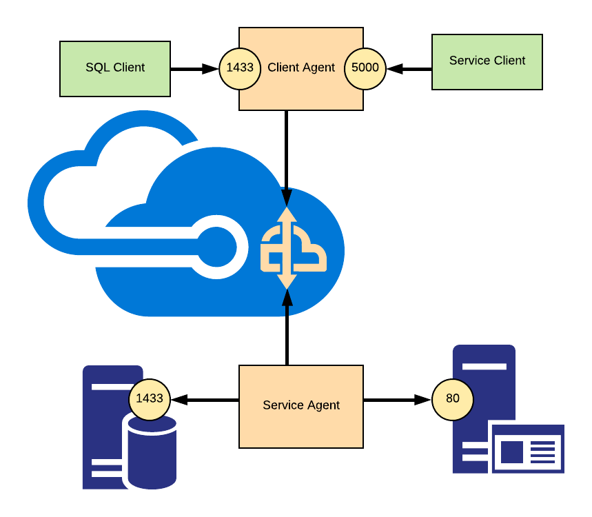

# Azure Hybrid Connection Relay Port Bridge

"Hybrid Port Bridge" is a point-to-point tunneling utility that allows mapping 
TCP listener ports from a machine on network A to another machine on a different 
network B, and make it appear as if the listener were local on network B. 

The utility is based on the original sample from Microsoft found here:
https://github.com/Azure/azure-relay/tree/master/samples/hybrid-connections/dotnet/portbridge

Hybrid Port Bridge is similar to what can generally be achieved via SSH tunneling, but
is realized over the Relay so that both parties can reside safely behind Firewalls,
leverage the Service Bus authorization integration, and have all communication run
over the Firewall-friendly WebSocket protocol. 

## How it works      

Hybrid Port Bridge consists of two components, the "Port Bridge Service Agent" and the 
"Port Bridge Client Agent". 

The Client Agent’s job is to listen for and accept TCP on a configurable port. 
The Service Agents’s job is to accept for incoming connections from the Client Agent, 
establish a connection with the Client Agent, and pump the data from the Client Agent 
to the actual listening service – and vice versa. 



In the picture above you see that the Service Agent is configured to connect to a SQL Server 
listening at the SQL Server default port 1433 and that the Client Agent – running on 
a different machine, is listening on port 1433 as well, thus mapping the remote SQL Server 
onto the Client Agent machine as if it ran there. You can (and I think of that as 
to be more common) map the service on the Agent to any port you like – say higher up at 41433.

In order to increase the responsiveness and throughput for protocols that are
happy to kill and reestablish connections frequently such as HTTP, "Hybrid Port Bridge"
always multiplexes concurrent socket connections between two parties over the
same relayed connection.  

## How do I use it?

There are several packages that can be used:
* DocaLabs.HybridPortBridge.ClientAgent.Console targeting .Net Core
* DocaLabs.HybridPortBridge.ServiceAgent.Console targeting .Net Core
* Docker images for Linux and Windows for the above packages
* DocaLabs.HybridPortBridge.ClientAgent.WindowsService targeting .Net v4.72
* DocaLabs.HybridPortBridge.ServiceAgent.WindowsService targeting .Net v4.72

### Service Agent

The DocaLabs.HybridPortBridge.ServiceAgent.WindowsService executables file 
is both a console app and a Windows Service. By default it starts as a Windows service, 
you can force console-mode with the –-console command line option.

The appsettings.json file on the Service Side specifies what Service Bus Relay entities 
it must listen to. The ports and host names which you want to project a configured in
the corresponding entities' metadata. Each instance can listen to multiple entities
and each entity can be projected to multiple services. The entity metadata key should 
correspond to configured values on the Client Agent side and the value is in format:
'tcp:host-name:port'. The value must be no longer than 75 characters long.  

``` JSON
{
  "Serilog": {
    "Using": [ "Serilog.Sinks.Console", "Serilog.Sinks.RollingFile" ],
    "MinimumLevel": {
      "Default": "Verbose",
      "Override": {
        "Microsoft": "Warning"
      }
    },
    "WriteTo": [
      {
        "Name": "Console",
        "Args": { "outputTemplate": "{Timestamp:yyyy-MM-dd HH:mm:ss.fff} [{Level}] <{SourceContext}> {Message}{NewLine}{Exception}" }
      },
      {
        "Name": "RollingFile",
        "Args": {
          "pathFormat": "./logs/log-{Date}.txt",
          "fileSizeLimitBytes": "10240",
          "retainedFileCountLimit": 5,
          "outputTemplate": "{Timestamp:yyyy-MM-dd HH:mm:ss.fff zzz} [{Level}] [{SourceContext}] {Message}{NewLine}{Exception}"
        }
      }
    ],
    "Properties": {
      "Application": "Azure.Relay.ReverseProxy"
    }
  },

  "PortBridge": {
    "ServiceNamespace" : {
        "ServiceNamespace": "mynamespace.servicebus.windows.net",
        "AccessRuleName": "RootManageSharedAccessKey",
        "AccessRuleKey": "xxxxxxxx"
    },
    "EntityPaths": [
      "sql"
    ]
  }
}
```

The ServiceBusNamespace attribute takes your Service Bus namespace name, and the
serviceBusAccessRuleName and serviceBusAccessRuleKey attributes are set to the 
SAS rule you want to use. 

The EntityPaths contains a list of entity names which should be listened to.

As the executables are using Microsoft Configuration Extensions the settings can be
supplied using the environment variables or command line arguments as well as the
executables are looking for the '/settings/appsettings.json' and 
'/secrets/appsettings.json' files so you can map a volumes in Docker at runtime. 

### Client Agent

The DocaLabs.HybridPortBridge.ClientAgent.WindowsService executables file 
is both a console app and a Windows Service. By default it starts as a Windows service, 
you can force console-mode with the –-console command line option..

The appsettings.json file on the Client Agent side specifies which ports you want to project 
into the Service Agent machine.

``` JSON
{
  "Serilog": {
    "Using": [ "Serilog.Sinks.Console", "Serilog.Sinks.RollingFile" ],
    "MinimumLevel": {
      "Default": "Verbose",
      "Override": {
        "Microsoft": "Warning"
      }
    },
    "WriteTo": [
      {
        "Name": "Console",
        "Args": { "outputTemplate": "{Timestamp:yyyy-MM-dd HH:mm:ss.fff} [{Level}] <{SourceContext}> {Message}{NewLine}{Exception}" }
      },
      {
        "Name": "RollingFile",
        "Args": {
          "pathFormat": "./logs/log-{Date}.txt",
          "fileSizeLimitBytes": "10240",
          "retainedFileCountLimit": 5,
          "outputTemplate": "{Timestamp:yyyy-MM-dd HH:mm:ss.fff zzz} [{Level}] [{SourceContext}] {Message}{NewLine}{Exception}"
        }
      }
    ],
    "Properties": {
      "Application": "Azure.Relay.ReverseProxy"
    }
  },

  "PortBridge": {
    "PortMappings": {
        "ServiceNamespace" : {
            "ServiceNamespace": "mynamespace.servicebus.windows.net",
            "AccessRuleName": "RootManageSharedAccessKey",
            "AccessRuleKey": "xxxxxxxx"
        },
        "1433": {
            "EntityPath": "sql",
            "RelayChannelCount": 1,
            "RemoteConfigurationKey": "1433",
            "AcceptFromIpAddresses": [
              "127.0.0.1"
            ]
        }
    }
  }
}
```

Again, the ServiceBusNamespace attribute takes your Service Bus namespace name,
and serviceBusAccessRuleName plus serviceBusAccessRuleKey the SAS rule information.

The portMappings dictionary holds the individual ports you want to
bring onto the local machine. Once Service and Client Agents are running, 
you can connect to the Client Agent machine on port 1433 using any SQL client.
RemoteConfigurationKey must correspond to the metadata key in the corresponding entity.

The AcceptFromIpAddresses collection allows (un-)constraining the TCP clients that may
connect to the projected port. By default, only connections from the same
machine are permitted.